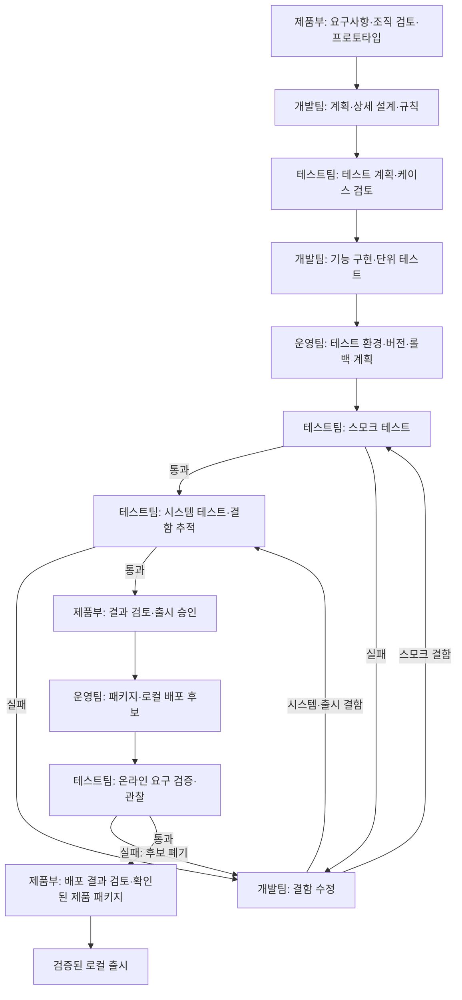

# 이미지 기반 AX 개발 흐름

입력은 `reference-process.png`의 소프트웨어 개발 프로세스입니다. 실제 과제는 AX 대시보드의 에이전트 검색·상태 필터이며, 각 팀이 실제 Codex를 호출합니다. Paperclip은 팀·작업·의존 관계·실행 기록·케이스 전환을 저장합니다.

| 원본 이미지 단계 | Paperclip 단계 | 실제 산출물·게이트 |
|---|---|---|
| 제품 단계 | requirements | 요구사항 명세·조직 검토·텍스트 프로토타입 |
| 개발 단계 | design, test-plan, implement, environment, smoke | 개발 계획·상세 설계·개발 규칙·테스트 케이스·AX 코드·단위 테스트·테스트 환경·버전 관리 계획·브라우저 스모크 테스트 |
| 시스템 테스트 | system, fix, approval | 자동 테스트·브라우저 테스트·결함 보고·수정·재검증·제품부 출시 승인·릴리스 노트 |
| 온라인 | release, acceptance, delivery-review | 승인된 코드로 배포 패키지 생성·localhost 후보 실행·온라인 기능 검증·릴리스 체크리스트·제품부의 배포 결과 검토·확인된 패키지 선택 |

원본의 제품부 문서 검토, 개발팀 설계 검토, 테스트팀 케이스 검토는 각각 해당 단계 산출물에 포함합니다. 결함 발견 작업은 `done`으로 기록하되 QA 결과는 `fail`로 별도 저장합니다. 이는 결함을 발견하고 보고하는 업무의 완료이며, 제품 통과를 의미하지 않습니다. 실제 명령과 브라우저 검증 결과가 통과해야 다음 개발/배포 단계로 갈 수 있습니다.

출시 승인은 이 실험에서 제품부 에이전트의 검토입니다. 외부 게시나 사람의 승인을 대신하지 않습니다. 온라인 환경은 localhost로 제한하며 원본 대화 기록과 인증 파일을 수정하지 않습니다.

시스템 QA 실행이 끝났지만 reconciliation blocker 때문에 기존 승인 작업이 멈추면 `node experiments/paperclip/ax-controller.mjs revalidate --reason '승인 보류 범위를 현재 기준으로 다시 확인합니다.'`로 보조 QA를 만들 수 있습니다. 보조 작업은 고정된 workflow의 시스템 테스트 담당자가 맡고 완료된 직전 시스템 QA에 의존하며 케이스에 연결됩니다. 기존 제품부 승인 의존성은 보존하면서 승인 작업을 새 QA에 의존시킵니다. 원래 주 작업 목록과 케이스 커서는 유지됩니다. 보조 QA의 native 실행과 이슈가 완료되고 현재 `system.json`이 저장된 검증 결과와 같을 때에만 원래 승인 실행을 복구할 수 있습니다.

보조 QA provider 실행이 중단된 경우에는 실제 결과를 검토한 뒤 `node experiments/paperclip/ax-controller.mjs revalidate --outcome mixed --evidence '일부 검사는 실행됐지만 QA 작업은 끝나지 않은 것으로 확인했습니다.'`로 그 보조 실행을 복구합니다. 실행 `muyiny8j`에서는 AXM-44 보조 QA가 pass/done으로 완료됐고, 원래 승인 AXM-43은 정식 복구 경로에서 pass가 확인됐습니다. 이어 release AXM-45, acceptance AXM-46, 최종 제품부 검토 AXM-47까지 수락되어 작업 흐름을 완료했습니다.

온라인 인수 이후 `delivery-review`에서 제품부가 실제 인수 실행·작업 ID와 배포 패키지 해시, 정적 파일 전달 결과를 검토합니다. 이 검토까지 통과해야 새 출시를 선택합니다. 이 단계는 새로 생성하는 기본 흐름과 후속 개선 흐름에 적용하며, 이전 정의를 보존한 실행의 기록과 전환은 유지합니다.

수락된 대형 트리 개선 실행 `muydy728`은 체인과 넓은 트리 각 100·1,000·3,000개 화면 검증을 모두 통과하고 정식 인수·배달 검토를 마쳤습니다. 실패·취소 실행과 복구 전 제품부의 미연결 배달 거절은 이력으로 남아 있습니다. 역사적 후보의 자산 기준은 포장 당시가 아니라 검증 시점이며, 이 차이는 배달 검토에서 명시했습니다. 후속 navigation 기준은 별도 실행 `muyiny8j`에서 위치 순번, 순환 이동, 검색·상태·범위·초기화 뒤 위치 재설정 및 같은 범위 폴링 중 유지 동작을 확인하고 최종 수락했습니다.

`muyhf5a7`은 여섯 navigation 사례와 정적 자산 3개의 packaging-time 전달 검증으로 제품부 수락을 마쳤습니다. 이후 `muyiny8j`에서 이전·다음 항목 이동과 함께 현재 위치 `k/N`을 표시하고, 검색·상태·범위·초기화 변경 때 위치를 재설정하며 같은 범위의 유효한 갱신에서는 유지하도록 개선했습니다. 여섯 navigation 사례가 새 계약으로 다시 통과했고 최종 제품부도 수락했습니다. verifier의 position contract 확장은 이전 수락을 소급해 결함 판정하지 않습니다. `muyhf5a7` 서버 런타임 파일 5개 guard 검사는 제품부 수락 후 별도로 수행한 확인입니다. 최종 적용 저장소의 [전체 검증 요약](./runs/muyiny8j/final-repository-validation.json)에는 unit 148, browser 23, navigation 6, synthetic graph 500, topology 6의 결과가 연결되어 있습니다. [최종 localhost 전달·런타임](./runs/muyiny8j/final-local-verification.json)과 [rollback 확인](./runs/muyiny8j/rollback-readiness.json)도 참조할 수 있습니다.

기존 3단계 Slugify 실험은 유지합니다. AX 작업은 별도 회사·워크스페이스·상태 파일·파이프라인을 사용합니다. 상세 실행법은 [README](./README.md)를 확인합니다.
