# 작업 중 확인한 이미지

이미지 기반 AX 개발 작업에서 확인한 원본과 화면을 단계별로 모았습니다. AX 화면은 합성 데이터로 촬영했으며, Paperclip 화면은 격리된 실험 인스턴스입니다. 아래 화면은 촬영 당시 상태이며 최종 통과 근거는 [실행 기록](../runs/README.md)의 JSON·문서 보고서를 확인하세요.

원본 PNG를 변형 없이 보존했습니다. 크기·SHA-256·출처는 [manifest.json](./manifest.json)에 기록했습니다. 동일한 최종 스모크 이미지와 원본 프로세스의 작업 공간 복사본은 중복 저장하지 않았습니다.

## 입력 프로세스 이미지

[원본 이미지](../reference-process.png) · [팀과 단계 대응](../FLOW.md)

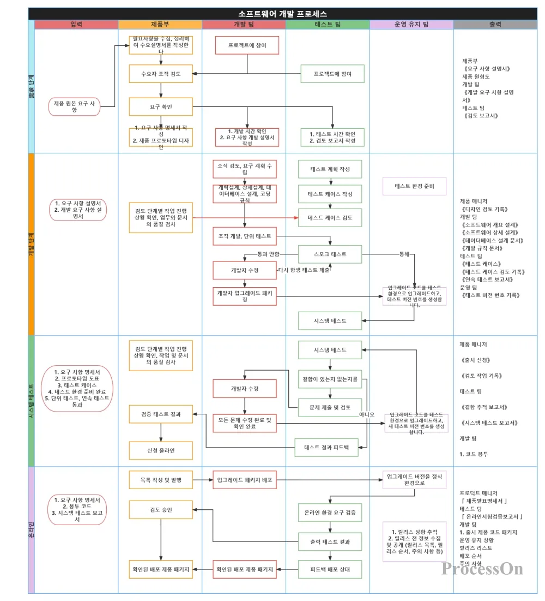

## 최종 기능 화면

검색 결과 3개 중 두 번째 항목으로 이동한 상태입니다. 상세 선택은 별도로 유지됩니다.

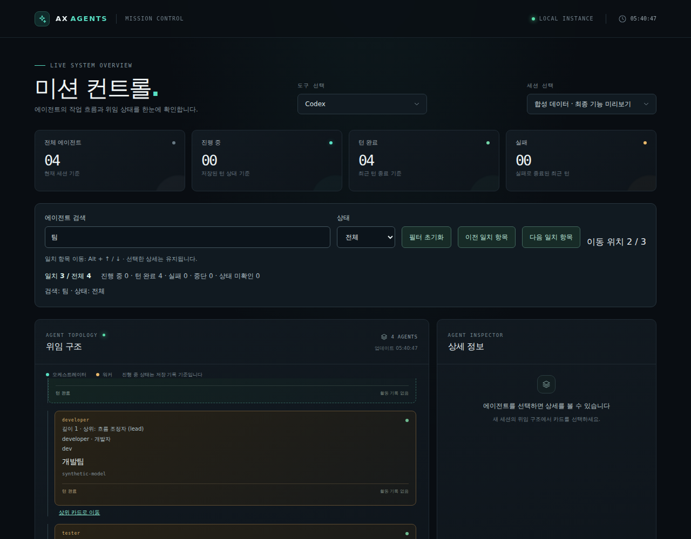

## Paperclip 실행 화면

### 기존 3에이전트 예제 대시보드

기존 3에이전트 예제를 확인한 화면입니다.

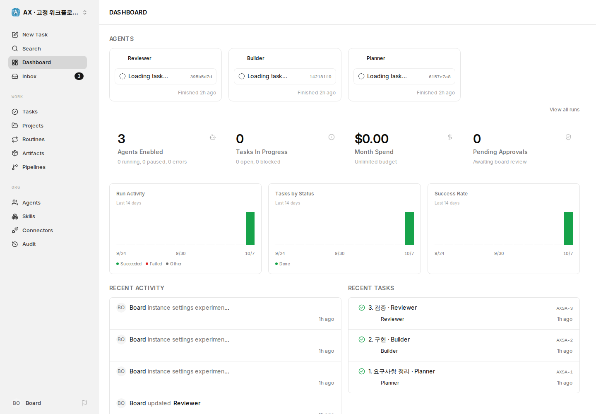

### AX 개발 파이프라인 생성·실행 화면

AX 파이프라인 생성 후 실행 중에 확인한 화면입니다. 최종 수락 상태를 나타내는 화면은 아닙니다.

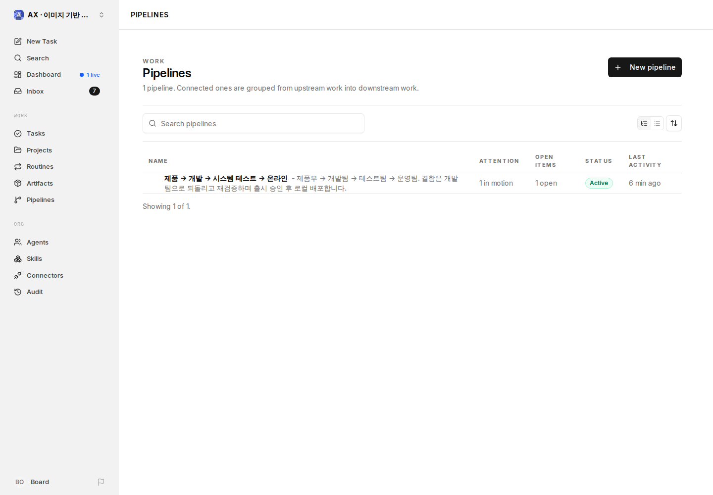

## 모바일·대형 트리 확인 화면

전체 페이지 캡처는 스크롤 위치에 따라 고정 헤더가 중간에 표시되거나 트리 영역 일부가 잘릴 수 있습니다. 각 원본을 열어 확인할 수 있습니다.

| 화면 | 실행·설명 | 원본 크기 |
|---|---|---|
| <a href="./ax-filter-mobile-overview.png">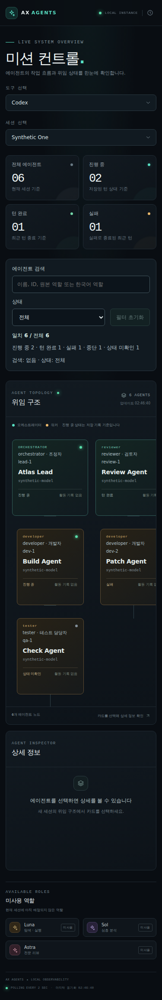</a> | 초기 기능 확인 검색·상태 필터 초기 모바일 전체 화면 | 375 × 2307 |
| <a href="./ax-muy8gyek-mobile-smoke.png">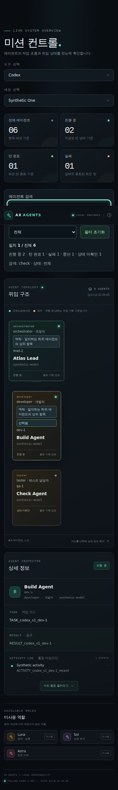</a> | [muy8gyek](../runs/muy8gyek/execution.json) 초기 기능 모바일 스모크 | 375 × 2492 |
|  | [muycf1mz](../runs/muycf1mz/execution.json) 필터 계산 개선 후 모바일 스모크 | 375 × 2492 |
| <a href="./ax-muydy728-mobile-smoke.png">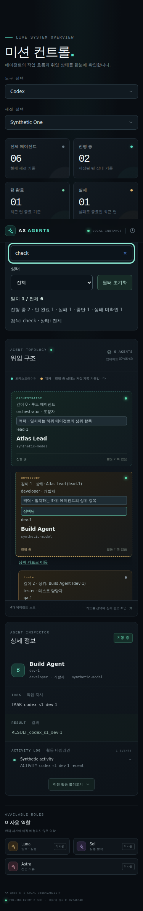</a> | [muydy728](../runs/muydy728/execution.json) 평탄한 트리 표시 개선 후 모바일 스모크 | 375 × 2360 |
| <a href="./ax-muydy728-deep-tree-mobile.png">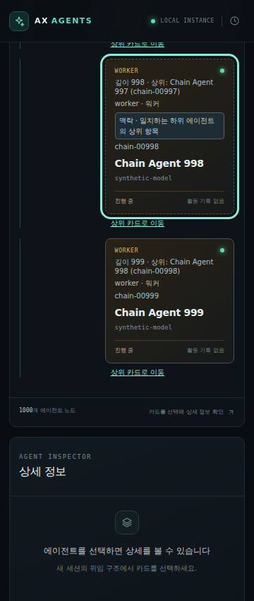</a> | [muydy728](../runs/muydy728/execution.json) 1,000개 연쇄 관계의 깊이 998·999 모바일 확인 | 360 × 850 |
| <a href="./ax-muyhf5a7-mobile-smoke.png">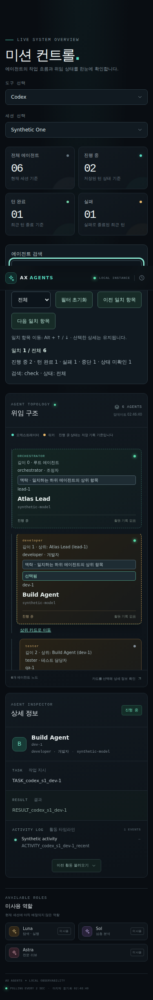</a> | [muyhf5a7](../runs/muyhf5a7/execution.json) 이전·다음 항목 이동 추가 후 모바일 스모크 | 375 × 2442 |
| <a href="./ax-muyhf5a7-navigation-mobile.png">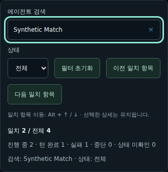</a> | [muyhf5a7](../runs/muyhf5a7/execution.json) 모바일 검색·이동 버튼·키보드 안내 영역 | 334 × 341 |
| <a href="./ax-muyiny8j-mobile-smoke.png">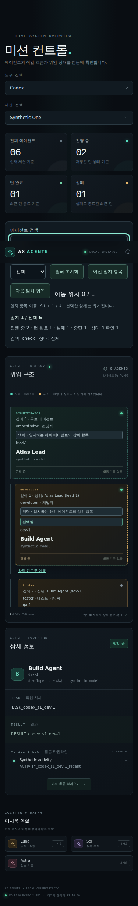</a> | [muyiny8j](../runs/muyiny8j/execution.json) 이동 순번 추가 후 최종 모바일 스모크 | 375 × 2442 |
